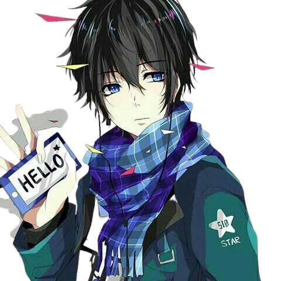

## Olá eu sou o Matheus 

Sou uma pessoa que ama programar e quer se tornar um programador front-end  
mais no momento faço um pouco de front-end e back-end. 
Estudante de programação que não rejeita um bom desafio ⚔❤😉. 
Sempre tentando me superar e achar novos desafios e não importa o desafio 
tento superá-lo.

### *Trivia About Me   

<li>gosto de games🎮🕹/ </li>

<li> gosto muito de músicas 🎶🎧/ </li>         

<li>filmes e animes 🎬🎥/ </li>

<li>Toco batera 🥢/ </li>

 
  

 
 #### *Vamos juntos mergulhar na programação.*
Este é meu perfil na rocketseat https://app.rocketseat.com.br/me/matheus-lucas-nunes-00546

  

 
 

 
 
  
 ### Visitas no Perfil.
 
 
 

 #### 📚 Tecnologia que uso:

